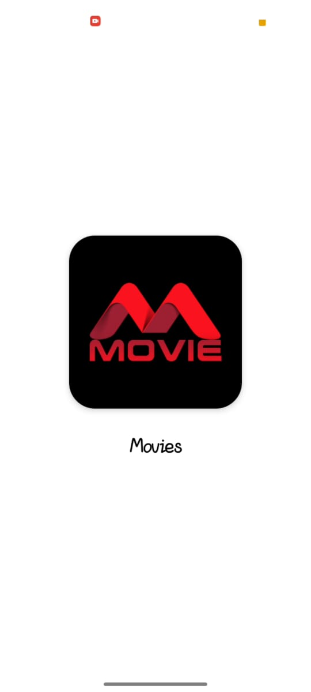
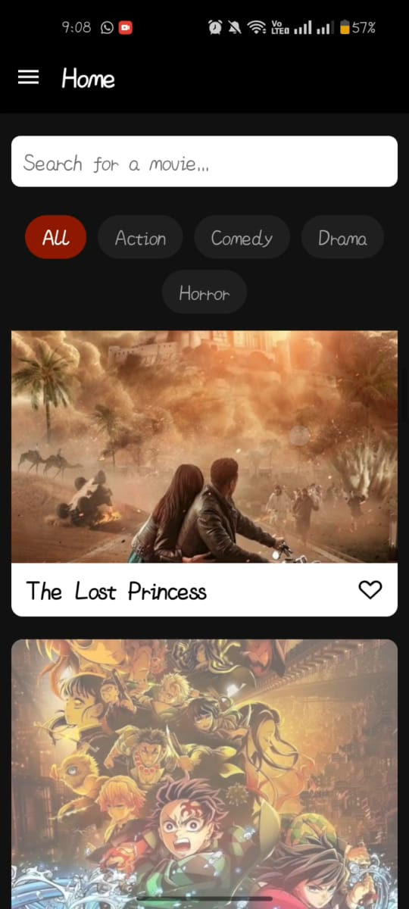
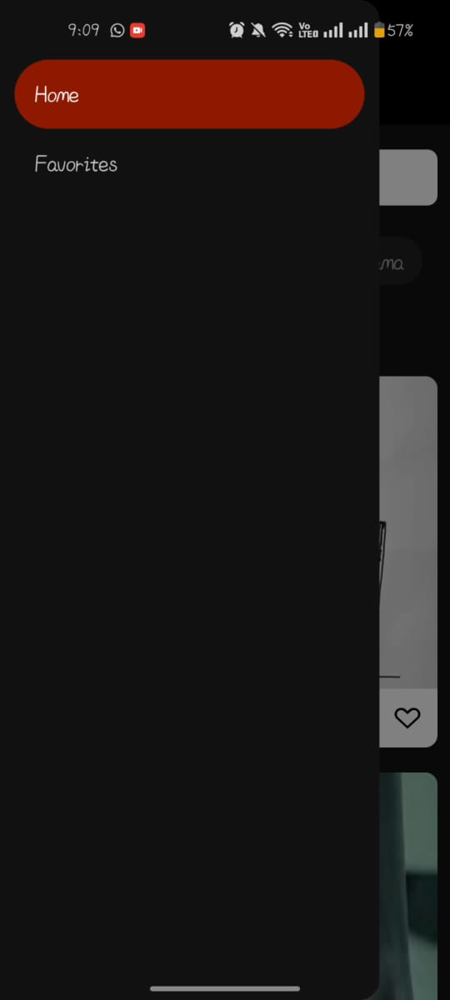
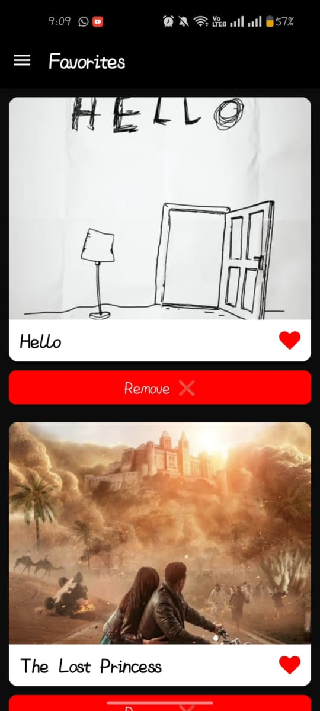
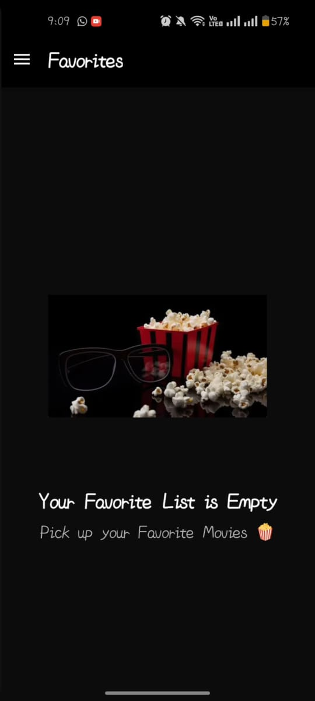

A modern, cross-platform React Native application that allows users to browse, search, and explore movies online.
Built with React Native + Expo, the app features Home, Movies, About, and Contact screens — all designed with a clean, user-friendly interface.

---

## 🚀 Features

### 🏠 Home Page

-Beautiful and engaging landing screen

-Highlights trending and featured movies

### 🎞️ Movies Screen

-Browse and search movies by genre or title

-View detailed movie information: poster, release date, description, and rating

-Add movies to Favorites or Watchlist

 

## 🛠️ Technology Stack

 
 ###Frontend (Mobile)

- **React Native 0.76+** – Modern framework for cross-platform mobile apps

- **Expo SDK 51+** – Simplifies development and testing

- **React Navigation 7**– Screen navigation and stack/tab handling

- **Axios**– Fetch movie data from API

- **React Native Paper**/ Elements – UI components

- **Vector Icons**– Beautiful icons for UI elements

 

---

## 📁 Project Structure

```
 
📦 
├─ .gitignore
├─ App.js
├─ api
│  └─ moviesApi.jsx
├─ app.json
├─ assets
│  ├─ OIP.webp
│  ├─ m.jpg
│  └─ unnamed.png
├─ components
│  ├─ MovieCard.jsx
│  ├─ SearchBar.jsx
│  └─ Test.jsx
├─ context
│  └─ FavoritesContext.jsx
├─ index.js
├─ navigation
│  └─ DrawerNavigator.jsx
├─ package-lock.json
├─ package.json
└─ screens
   ├─ FavoritesScreen.jsx
   └─ HomeScreen.jsx
```
 

---

## 🚀 Getting Started

### Prerequisites

- Node.js (v14 or higher)
- npm or yarn

## 🚀 Getting Started

### Prerequisites

- Node.js v14+

- Expo CLI or React Native CLI installed globally

- Android Studio / Xcode (for emulator or physical device testing)

### Installation

1. **Clone the repository**

   ```
   git clone https://github.com/Mariam433477/movies
   cd movies
   ```

2. **Install Frontend Dependencies**
   ```
   npm install


   ```

### Running the Application

1. **Start the Frontend Development Server**

   ``` 
   npx expo start
   ```

## 📸 Screenshots

### 🏠 Splash Page



### Home Page


### Drawar Page


### Favourite Page


### NoFavourite Page


 

## 🎯 Key Features Implementation

### Navigation

- Implemented using React Navigation (Stack + Bottom Tabs)

- Dynamic routing for movie details by ID

### Data Fetching

- Uses Axios to fetch data from TMDB API or a custom movie API

## 🎨 UI/UX Features

- Responsive Design: Works smoothly on Android and iOS

- Theming: Light & Dark mode support

- Smooth Animations with React Native Reanimated or Lottie

- Error Handling & Loading States

- Accessible Components for better usability

## 🔧 Development Scripts

### Frontend Scripts

```
npm start        # Start Expo development server
npm run android  # Run on Android emulator/device
npm run ios      # Run on iOS simulator/device
npm run web      # Preview in browser (Expo web)

```

## 📱 Browser Support

- Android 10 +

- iOS 14 +

## 🤝 Contributing

1. FFork the repository

2. Create a feature branch (git checkout -b feature/AmazingFeature)

3. Commit your changes (git commit -m 'Add some AmazingFeature')

4. Push to your branch (git push origin feature/AmazingFeature)

5. Open a Pull Request

## 🙏 Acknowledgments

- TMDB API for movie data

- React Native Community for libraries and tools

- Expo for simplifying cross-platform development

---

**Enjoy Watching Movies — Anytime, Anywhere! 🍿📱**
